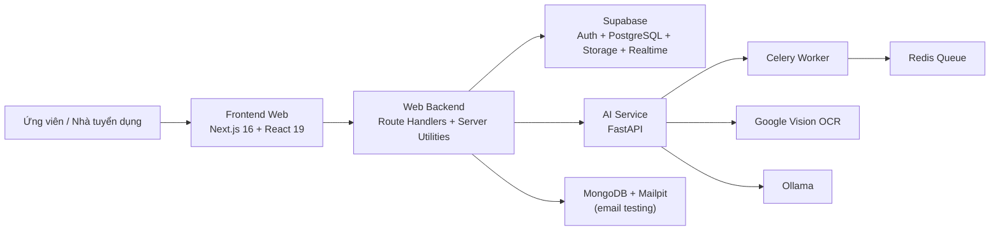
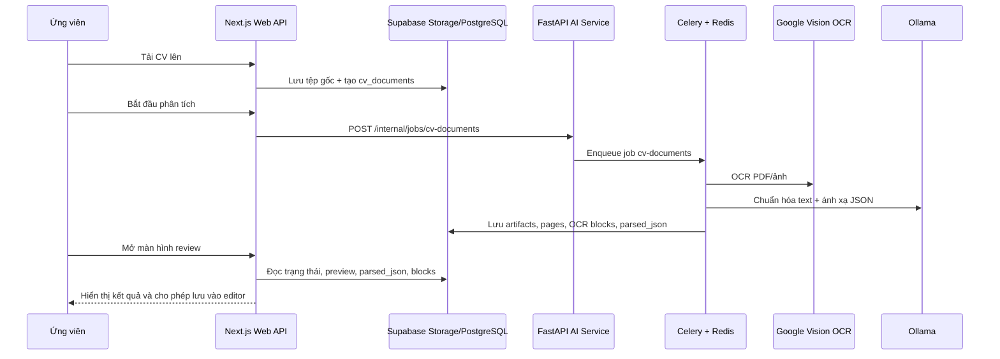

# Chương 2: Phân tích hệ thống và cơ sở lý thuyết

## 2.1 Tổng quan hệ thống

TalentFlow là một nền tảng tuyển dụng web có hỗ trợ AI, được thiết kế để hợp nhất ba luồng nghiệp vụ vốn thường tách rời trong các hệ thống tuyển dụng số: quản lý việc làm công khai, quản lý hồ sơ/CV ứng viên và quản lý tiến trình ứng tuyển. Thay vì chỉ lưu tệp CV như tài liệu đính kèm, hệ thống triển khai cơ chế xử lý dữ liệu hồ sơ theo hướng chuyển đổi tài liệu phi cấu trúc thành dữ liệu có thể chỉnh sửa, tìm kiếm và tái sử dụng trong các tác vụ tuyển dụng tiếp theo.

Ở cấp độ triển khai, hệ thống gồm hai cụm xử lý chính. Cụm thứ nhất là ứng dụng web xây dựng trên Next.js, phụ trách giao diện, API web, xác thực, thao tác nghiệp vụ và điều phối dữ liệu tới Supabase. Cụm thứ hai là dịch vụ AI viết bằng FastAPI, kết hợp Celery và Redis để xử lý bất đồng bộ các tác vụ OCR, phân tích bố cục và chuẩn hóa hồ sơ. Cách tổ chức này cho phép tách biệt rõ giữa luồng tương tác thời gian thực của người dùng và luồng xử lý tính toán nặng của tài liệu CV.

Từ góc nhìn chức năng, TalentFlow bao phủ các năng lực sau:

- Truy cập và tìm kiếm việc làm công khai.
- Quản lý hồ sơ ứng viên và CV.
- Nhập CV từ tệp PDF, DOCX và ảnh, sau đó xử lý OCR và ánh xạ vào editor.
- Nộp đơn ứng tuyển và theo dõi trạng thái ATS.
- Tìm kiếm ứng viên công khai từ phía nhà tuyển dụng.
- Gợi ý việc làm trên cơ sở hồ sơ ứng viên.
- Gửi và hiển thị thông báo nghiệp vụ.

Các năng lực trên chứng tỏ hệ thống được thiết kế theo hướng “data-centric recruitment platform”, trong đó dữ liệu hồ sơ không phải đầu ra tĩnh mà là đầu vào cho các tác vụ suy luận, đồng bộ, gợi ý và khai thác tuyển dụng.

## 2.2 Mô hình kiến trúc hệ thống

### 2.2.1 Kiến trúc bốn lớp

TalentFlow có thể được mô tả theo kiến trúc bốn lớp: giao diện web, backend web, backend AI và lớp dữ liệu.

| Lớp kiến trúc | Thành phần chính | Vai trò trong hệ thống |
| --- | --- | --- |
| Giao diện web | Next.js 16, React 19, App Router, client/server components | Hiển thị cổng việc làm, dashboard, CV Builder, review OCR và khu HR |
| Backend web | Route Handlers, server-only libraries, Supabase server/admin clients | Kiểm tra quyền truy cập, điều phối nghiệp vụ, giao tiếp với AI service và cơ sở dữ liệu |
| Backend AI | FastAPI, Celery, Redis, Google Vision OCR, Ollama | Xử lý OCR, chuẩn hóa nội dung, phân tích CV, gợi ý và tách tác vụ nền |
| Lớp dữ liệu | Supabase PostgreSQL, Storage, Auth, RLS, Realtime; MongoDB cho email testing | Lưu dữ liệu nghiệp vụ, tài liệu CV, artifact OCR/editor, trạng thái hệ thống |

### 2.2.2 Lớp giao diện web

Lớp giao diện được xây dựng bằng Next.js 16 với App Router và React 19. Cấu trúc route cho thấy hệ thống được chia thành các khu chức năng tách biệt nhưng dùng chung một codebase: khu công khai (`(public)`), khu xác thực (`(auth)`), khu ứng viên (`/candidate`) và khu nhà tuyển dụng/HR (`/hr-home`, API recruiter). Cách tổ chức này giúp hệ thống tận dụng khả năng kết hợp giữa server component và client component theo từng ngữ cảnh hiển thị.

Một số đặc điểm đáng chú ý của lớp này gồm:

- Trang chủ công khai và trang việc làm lấy dữ liệu từ lớp server để tối ưu hiển thị danh sách công việc.
- Dashboard ứng viên kết hợp dữ liệu hồ sơ, trạng thái ứng tuyển, việc làm gợi ý và CV đã lưu.
- Khu CV Builder cung cấp khả năng tạo mới, chỉnh sửa, import và review kết quả OCR trước khi đồng bộ vào editor.
- Các modal như OCR workspace hoặc review import được nạp động để giảm chi phí tải trang ban đầu.

Như vậy, frontend không chỉ là lớp hiển thị tĩnh mà còn là điểm hội tụ của nhiều trạng thái nghiệp vụ: hồ sơ ứng viên, review tài liệu, tiến trình xử lý bất đồng bộ và dữ liệu thời gian thực.

### 2.2.3 Lớp backend web

Backend web được hiện thực ngay trong codebase Next.js thông qua hệ thống Route Handlers và các thư viện server-side nằm dưới `src/lib`. Đây là lớp chịu trách nhiệm:

- Xác thực người dùng và phân quyền theo vai trò thông qua Supabase Auth.
- Kiểm tra dữ liệu đầu vào cho các nghiệp vụ như nộp đơn, upload CV, tìm kiếm ứng viên, cập nhật hồ sơ.
- Điều phối dữ liệu giữa frontend với Supabase và AI service.
- Cô lập logic nghiệp vụ khỏi tầng giao diện, ví dụ: tuyển dụng (`recruitment.ts`), ứng tuyển (`applications.ts`), hồ sơ ứng viên (`candidate-profiles.ts`), import CV (`cv-imports.ts`) và thông báo (`notifications.ts`).

Các nhóm API quan trọng trong hệ thống bao gồm:

- API việc làm và ứng tuyển: `/api/jobs`, `/api/applications`, `/api/apply-job`.
- API hồ sơ và dashboard ứng viên: `/api/candidate/profile`, `/api/candidate/dashboard`, `/api/candidate/cv-options`.
- API CV Builder và import CV: `/api/cv-builder/*`, `/api/cv-imports/*`, `/api/ai/upload-cv`, `/api/ai/prepare-preview`.
- API tuyển dụng phía HR: `/api/recruiter/*`, `/api/notifications`.
- API gợi ý việc làm: `/api/recommend-jobs`.

Cách tổ chức backend web như vậy phù hợp với quy mô bài toán vì cho phép gom logic tương tác nghiệp vụ vào cùng môi trường triển khai với giao diện, đồng thời vẫn tách riêng các tác vụ AI nặng sang một dịch vụ chuyên trách.

### 2.2.4 Lớp backend AI

Lớp backend AI được xây dựng bằng FastAPI và cung cấp các endpoint xử lý tài liệu CV. Trong mã nguồn hiện tại, dịch vụ này hỗ trợ các nhóm chức năng chính:

- Kiểm tra trạng thái dịch vụ qua `/health`.
- Phân tích CV qua `/parse-cv`, `/parse-cv-v2` và `/upload-cv`.
- Tạo preview tài liệu qua `/preview/upload` và `/preview/{preview_id}`.
- Nhận OCR thô hoặc re-parse block chỉnh sửa qua `/ocr/upload` và `/parse-ocr-blocks`.
- Gợi ý cải thiện CV qua `/cv-suggestions`.
- Tính độ tương đồng CV - mô tả công việc qua `/match-job`.
- Nhận lệnh enqueue job nội bộ qua `/internal/jobs/cv-documents`.

Điểm quan trọng của lớp này là cơ chế xử lý bất đồng bộ. Khi người dùng bắt đầu phân tích một tài liệu CV, ứng dụng web không thực hiện toàn bộ pipeline trong request đồng bộ. Thay vào đó, hệ thống enqueue job vào hàng đợi `cv-documents`, sau đó Celery worker tiếp nhận và xử lý từng giai đoạn như OCR, phân tích bố cục, chuẩn hóa và persist kết quả. Cách tiếp cận này giảm nguy cơ timeout ở lớp web và cho phép hệ thống lưu vết tiến độ xử lý vào cơ sở dữ liệu.

Về công nghệ AI, lớp này sử dụng:

- **Google Vision OCR** để trích xuất văn bản và bounding boxes từ PDF/ảnh.
- **Ollama** để chuẩn hóa OCR text, ánh xạ dữ liệu vào JSON cấu trúc, tạo gợi ý cải thiện CV và hỗ trợ xếp hạng/gợi ý việc làm ở các luồng dùng mô hình cục bộ.

### 2.2.5 Lớp dữ liệu

Lớp dữ liệu trung tâm của TalentFlow là Supabase PostgreSQL kết hợp Auth, Storage, Realtime và Row Level Security. Đây là lựa chọn kiến trúc quan trọng vì hệ thống cần vừa lưu dữ liệu nghiệp vụ quan hệ, vừa lưu các artifact tài liệu và đồng bộ cập nhật theo thời gian thực.

Ngoài Supabase, dự án còn sử dụng MongoDB để phục vụ email testing trong môi trường phát triển. Tuy nhiên, MongoDB không đóng vai trò lõi trong các nghiệp vụ tuyển dụng chính của TalentFlow.

### 2.2.6 Các thực thể dữ liệu chính

Hệ thống hiện thực hai nhóm dữ liệu lớn: dữ liệu tuyển dụng nghiệp vụ và dữ liệu tài liệu CV.

| Thực thể | Vai trò | Quan hệ chính |
| --- | --- | --- |
| `employers` | Lưu hồ sơ nhà tuyển dụng/đơn vị tuyển dụng | liên kết với `auth.users`, liên hệ với `jobs`, `activity_logs` |
| `candidates` | Lưu danh bạ ứng viên phục vụ tuyển dụng | liên kết với `auth.users`, tham gia `applications` |
| `jobs` | Lưu tin tuyển dụng công khai và dữ liệu vị trí | liên kết với `employers`, được tham chiếu bởi `applications` |
| `applications` | Lưu đơn ứng tuyển, thông tin liên hệ, CV đính kèm và trạng thái | liên kết với `jobs`, `candidates` |
| `application_events` | Lưu lịch sử sự kiện theo từng đơn ứng tuyển | liên kết với `applications` |
| `notifications` | Lưu thông báo nội hệ thống cho người dùng | liên kết với `auth.users` qua `recipient_id` |
| `candidate_profiles` | Lưu hồ sơ ứng viên có cấu trúc và dữ liệu công khai | liên kết với `auth.users`, hỗ trợ tìm kiếm ứng viên |
| `job_recommendations` | Lưu cache kết quả gợi ý việc làm theo người dùng | liên kết với người dùng ứng viên |
| `cv_documents` | Bản ghi trung tâm của một phiên nhập CV | liên kết với người dùng, stage run, page, artifact |
| `cv_document_artifacts` | Lưu artifact của từng giai đoạn xử lý CV | liên kết với `cv_documents` |
| `cv_document_pages` | Lưu thông tin kích thước/canonical page cho tài liệu | liên kết với `cv_documents`, `cv_document_artifacts` |
| `cv_ocr_blocks` | Lưu text block sau OCR và metadata ánh xạ | liên kết với `cv_documents`, `cv_document_pages` |
| `cv_layout_blocks` | Lưu kết quả phân tích bố cục tài liệu | liên kết với `cv_documents`, `cv_document_pages` |
| `editable_cvs` | Lưu phiên bản CV có thể chỉnh sửa sau import | liên kết với `cv_documents` và người dùng |
| `editable_cv_blocks` | Lưu block chỉnh sửa của CV nhập vào editor | liên kết với `editable_cvs` |
| `editable_cv_versions` | Lưu snapshot phiên bản để khôi phục | liên kết với `editable_cvs` |

Từ bảng dữ liệu trên có thể thấy TalentFlow không chỉ lưu “kết quả cuối cùng” của một CV, mà lưu toàn bộ vòng đời xử lý tài liệu: tệp gốc, artifact trung gian, block OCR, block chỉnh sửa, mapping JSON và lịch sử phiên bản. Đây là tiền đề để hệ thống vừa minh bạch quá trình import, vừa cho phép người dùng hiệu chỉnh kết quả thay vì bị phụ thuộc hoàn toàn vào pipeline tự động.

### 2.2.7 Bảo mật và kiểm soát truy cập

Supabase Auth được sử dụng để quản lý danh tính người dùng, trong khi Row Level Security (RLS) được cấu hình tại các bảng trọng yếu như `employers`, `candidates`, `candidate_profiles`, `cv_documents`, `editable_cvs` và các bảng liên quan. Cơ chế này đảm bảo:

- Ứng viên chỉ đọc và chỉnh sửa hồ sơ, tài liệu CV và phiên bản editor của chính mình.
- Nhà tuyển dụng chỉ xem được dữ liệu ứng viên công khai hoặc ứng viên đã đi vào pipeline tuyển dụng của họ.
- Các bucket lưu trữ CV được kiểm soát theo thư mục người dùng.

Với một hệ thống chứa dữ liệu nghề nghiệp và tài liệu cá nhân, việc đưa RLS vào mô hình dữ liệu là lựa chọn phù hợp hơn so với để logic phân quyền hoàn toàn ở tầng giao diện.

## 2.3 Quy trình hoạt động của hệ thống

### 2.3.1 Quy trình quản lý hồ sơ và CV ứng viên

Quy trình đầu tiên trong TalentFlow là chuẩn hóa dữ liệu ứng viên ở phía người dùng:

1. Ứng viên đăng nhập và truy cập không gian cá nhân.
2. Ứng viên cập nhật hồ sơ cá nhân trong `candidate_profiles`.
3. Ứng viên có thể tạo CV mới trong CV Builder hoặc tải CV hồ sơ lên bucket `cv_uploads`.
4. Dữ liệu hồ sơ và CV được phản ánh lên dashboard ứng viên, nơi hệ thống tổng hợp mức độ hoàn thiện, số đơn ứng tuyển, số CV đã lưu và thông báo chưa đọc.

Điểm quan trọng của quy trình này là dữ liệu hồ sơ không tồn tại như một màn hình tĩnh. Nó trở thành nguồn đầu vào cho ít nhất ba tác vụ khác: gợi ý việc làm, nộp đơn ứng tuyển và tìm kiếm ứng viên công khai.

### 2.3.2 Quy trình nhập CV bằng OCR và review

Đây là một trong những quy trình kỹ thuật quan trọng nhất của TalentFlow.

1. Ứng viên tải tệp CV lên thông qua API import.
2. Ứng dụng web lưu tệp gốc vào bucket `cv-originals`, đồng thời tạo bản ghi `cv_documents` và artifact gốc.
3. Khi người dùng chọn bắt đầu phân tích, hệ thống enqueue job nội bộ cho AI service.
4. Celery worker nhận job, thực hiện OCR bằng Google Vision, chuẩn hóa nội dung bằng Ollama, phân tích bố cục, sinh JSON cấu trúc và lưu artifact theo từng giai đoạn.
5. Kết quả được persist vào các bảng như `cv_document_artifacts`, `cv_document_pages`, `cv_ocr_blocks`, `cv_layout_blocks`.
6. Người dùng mở màn hình review để xem preview tài liệu, block OCR, JSON đã parse và quyết định lưu vào dạng editable/original.
7. Khi cần, hệ thống tạo `editable_cvs`, `editable_cv_blocks`, mapping đồng bộ và snapshot phiên bản.

Quy trình trên cho thấy TalentFlow xử lý bài toán OCR theo hướng “human-in-the-loop”: hệ thống tự động hóa tối đa quá trình phân tích, nhưng vẫn dành cho người dùng một lớp review trước khi kết quả được coi là bản dữ liệu làm việc chính thức.

### 2.3.3 Quy trình ứng tuyển và ATS

Luồng ATS trong TalentFlow được xây dựng theo hướng gọn nhưng nhất quán:

1. Ứng viên chọn một tin tuyển dụng công khai.
2. Hệ thống nhận dữ liệu nộp đơn gồm thông tin liên hệ, giới thiệu ngắn và một trong ba nguồn CV: tệp mới tải lên, CV hồ sơ có sẵn hoặc CV sinh từ Builder.
3. Backend web chuẩn hóa dữ liệu ứng tuyển, lưu tệp vào bucket `cv_uploads` nếu cần, tạo bản ghi `applications` và ghi log vào `application_events`.
4. Hệ thống phát sinh thông báo nội bộ và gửi email nghiệp vụ nếu cấu hình email khả dụng.
5. Nhà tuyển dụng có thể xem danh sách ứng viên theo từng job, xem chi tiết đơn ứng tuyển và cập nhật trạng thái pipeline.

Trạng thái ứng tuyển hiện tại bao gồm các nhóm chính như `applied`, `reviewing`, `interview`, `offer`, `hired`, `rejected`. Việc tồn tại bảng sự kiện `application_events` cho phép hệ thống lưu dấu vết tiến trình thay vì chỉ ghi đè trạng thái hiện hành.

### 2.3.4 Quy trình tìm kiếm ứng viên từ phía nhà tuyển dụng

Khi ở vai trò HR, người dùng có thể truy cập API tìm kiếm ứng viên công khai. Nguồn dữ liệu cho luồng này là `candidate_profiles` với chế độ hiển thị công khai. Hệ thống hỗ trợ lọc theo:

- tên ứng viên,
- kỹ năng,
- headline nghề nghiệp,
- kinh nghiệm,
- từ khóa tổng hợp.

Điều này cho thấy TalentFlow được thiết kế không chỉ cho mô hình “ứng viên tìm việc”, mà còn hỗ trợ chiều ngược lại là “nhà tuyển dụng tìm ứng viên”.

### 2.3.5 Quy trình gợi ý việc làm

TalentFlow triển khai cơ chế gợi ý việc làm theo hai tầng:

- **Tầng luật cứng và chấm điểm cục bộ**: trích xuất hồ sơ ứng viên, lọc job không phù hợp, tính điểm và xếp hạng.
- **Tầng mô hình ngôn ngữ**: dùng mô hình cục bộ qua Ollama để xếp hạng sâu hơn khi có dữ liệu phù hợp; nếu không khả dụng, hệ thống quay về pipeline cục bộ.

Trong lớp tính điểm cục bộ, điểm phù hợp được mô hình hóa theo công thức:

\[
S = 0.60S_{skill} + 0.25S_{role} + 0.10S_{exp} + 0.05S_{loc}
\]

Trong đó:

- \(S_{skill}\): độ khớp kỹ năng giữa hồ sơ ứng viên và văn bản công việc.
- \(S_{role}\): độ tương đồng vai trò/ngữ nghĩa nghề nghiệp.
- \(S_{exp}\): độ phù hợp về số năm kinh nghiệm.
- \(S_{loc}\): mức độ phù hợp theo địa điểm.

Việc mã hóa tường minh trọng số này là một điểm mạnh về mặt thiết kế học thuật, bởi nó giúp hệ thống:

- dễ giải thích kết quả gợi ý,
- dễ điều chỉnh chiến lược xếp hạng,
- giảm phụ thuộc hoàn toàn vào mô hình ngôn ngữ như một hộp đen.

### 2.3.6 Dashboard và thông báo thời gian thực

Dashboard ứng viên sử dụng dữ liệu từ `applications`, `notifications`, `jobs`, `employers`, `resumes` và các bảng hồ sơ để xây dựng bức tranh trạng thái tổng hợp. Ở phía client, hệ thống đăng ký kênh Supabase Realtime cho các thay đổi trên `applications`, `notifications`, `jobs` và `employers`, nhờ đó dữ liệu có thể làm mới khi có biến động nghiệp vụ.

Cách thiết kế này đặc biệt phù hợp với nền tảng tuyển dụng vì:

- trạng thái ứng tuyển có thể thay đổi bất kỳ lúc nào,
- thông báo cần được cập nhật gần thời gian thực,
- danh sách việc làm và thương hiệu nhà tuyển dụng có thể ảnh hưởng trực tiếp tới dashboard.

## 2.4 Cơ sở lý thuyết và công nghệ sử dụng

### 2.4.1 Next.js 16 và React 19

Next.js 16 được lựa chọn vì hệ thống cần đồng thời giải quyết ba yêu cầu: giao diện công khai tối ưu truy cập, giao diện nghiệp vụ nhiều trạng thái cho ứng viên/HR và lớp API web tích hợp chặt với dữ liệu tuyển dụng. App Router cho phép tổ chức route theo miền chức năng, trong khi Route Handlers giúp đặt các API nghiệp vụ trong cùng không gian triển khai với frontend.

React 19 phù hợp với TalentFlow vì hệ thống có nhiều khu vực tương tác mạnh như dashboard, CV Builder, OCR review và các panel quản lý ứng viên. Việc giữ frontend và API trong cùng một nền tảng triển khai giúp giảm chi phí kết nối liên tầng, đồng thời tăng khả năng tái sử dụng type và logic điều phối.

### 2.4.2 Supabase PostgreSQL, Auth, Storage, Realtime và RLS

Supabase là nền tảng trung tâm của TalentFlow vì bài toán của hệ thống không chỉ là lưu dữ liệu quan hệ, mà còn cần đồng thời:

- quản lý người dùng và vai trò,
- lưu trữ tệp CV cùng artifact trung gian,
- kích hoạt cập nhật gần thời gian thực,
- bảo vệ dữ liệu cá nhân ở mức hàng dữ liệu.

PostgreSQL phù hợp với mô hình dữ liệu tuyển dụng vì hệ thống có nhiều quan hệ rõ ràng giữa người dùng, công việc, đơn ứng tuyển, hồ sơ và tài liệu CV. Các bảng chuyên biệt cho import CV chứng minh cơ sở dữ liệu phải đủ linh hoạt để lưu cả dữ liệu quan hệ và JSON metadata, trong khi vẫn duy trì khả năng truy vấn, index và kiểm soát nhất quán.

### 2.4.3 FastAPI, Celery và Redis

FastAPI được dùng cho AI service vì pipeline xử lý CV cần một môi trường Python thuận lợi cho OCR, xử lý tài liệu, ảnh và tích hợp mô hình ngôn ngữ. Tuy nhiên, chỉ FastAPI đồng bộ là chưa đủ, bởi quá trình OCR và phân tích CV có thể kéo dài hơn thời gian phù hợp của một request web thông thường. Do đó, Celery và Redis được sử dụng để tách tác vụ nền khỏi request-response trực tiếp.

Sự kết hợp này đem lại ba lợi ích rõ rệt:

- không khóa request của người dùng khi xử lý tài liệu lớn,
- cho phép theo dõi trạng thái nhiều giai đoạn của job,
- tạo nền tảng để mở rộng khi số lượng tài liệu tăng.

### 2.4.4 Google Vision OCR

Google Vision OCR được dùng cho bài toán trích xuất văn bản từ PDF và ảnh CV. Điểm quan trọng không chỉ là nhận diện ký tự, mà là khả năng trả về cấu trúc khối văn bản và bounding boxes. Đây là yêu cầu bắt buộc đối với TalentFlow, vì hệ thống không dừng ở việc lấy “text thuần”, mà cần:

- dựng preview theo từng trang,
- xác định block OCR phục vụ review,
- gắn text với vùng hiển thị trong editor,
- hỗ trợ re-parse khi người dùng chỉnh lại block.

Với yêu cầu như vậy, công cụ OCR chỉ trả chuỗi văn bản không đủ đáp ứng bài toán.

### 2.4.5 Ollama và mô hình ngôn ngữ cục bộ

Ollama được tích hợp như lớp mô hình cục bộ cho các tác vụ cần suy luận ngôn ngữ:

- chuẩn hóa OCR text tiếng Việt,
- ánh xạ dữ liệu CV vào JSON cấu trúc,
- sinh gợi ý cải thiện CV,
- xếp hạng/gợi ý việc làm trong một số luồng AI.

Việc sử dụng mô hình cục bộ phù hợp với TalentFlow ở hai khía cạnh. Thứ nhất, nhiều thao tác như chuẩn hóa OCR và mapping JSON cần xử lý dữ liệu cá nhân của ứng viên, do đó mô hình cục bộ giúp tăng khả năng kiểm soát luồng dữ liệu. Thứ hai, hệ thống vẫn có thể duy trì một lớp gợi ý AI ngay cả khi không phụ thuộc hoàn toàn vào API bên ngoài.

### 2.4.6 Gemini/Groq như dịch vụ AI phụ trợ

Trong mã nguồn web, Gemini và Groq xuất hiện ở tuyến `/api/ai/optimize-content` để hỗ trợ tối ưu nội dung CV theo từng section. Tuy nhiên, đây chỉ là năng lực phụ trợ ở tầng viết lại nội dung, không phải thành phần lõi của pipeline nhập CV. Vì vậy, trong phân tích kiến trúc, các dịch vụ này chỉ nên được xem là lớp AI bổ sung cho trải nghiệm biên tập, còn trục xử lý tài liệu chính của TalentFlow vẫn dựa trên FastAPI, Google Vision OCR và Ollama.

### 2.4.7 MongoDB và Mailpit trong môi trường kiểm thử

MongoDB và Mailpit được dùng trong luồng email testing để tạo tài khoản thử nghiệm, mô phỏng inbox và xác nhận hành vi gửi email. Đây là quyết định có ý nghĩa vận hành và kiểm thử, nhưng không thuộc lõi kiến trúc nghiệp vụ tuyển dụng. Việc tách bạch điều này là cần thiết để tránh đánh đồng công cụ hỗ trợ phát triển với thành phần cốt lõi của bài toán học thuật.

| Công nghệ | Vai trò trong TalentFlow | Lý do phù hợp với bài toán |
| --- | --- | --- |
| Next.js 16 + React 19 | giao diện web và API web | gom UI, routing và server logic vào một codebase thống nhất |
| TypeScript | chuẩn hóa kiểu dữ liệu liên tầng | giảm sai lệch giữa giao diện, API và model dữ liệu |
| Supabase PostgreSQL | dữ liệu nghiệp vụ tuyển dụng | phù hợp với mô hình dữ liệu quan hệ và mở rộng bằng JSONB |
| Supabase Auth + RLS | xác thực và phân quyền | bảo vệ dữ liệu cá nhân và dữ liệu tuyển dụng theo vai trò |
| Supabase Storage | lưu CV, preview, artifact | hỗ trợ lưu tệp gốc và sản phẩm trung gian của pipeline |
| Supabase Realtime | cập nhật dashboard/thông báo | đáp ứng nhu cầu phản hồi gần thời gian thực |
| FastAPI | dịch vụ AI/OCR | phù hợp với hệ sinh thái Python cho xử lý tài liệu |
| Celery + Redis | hàng đợi tác vụ nền | tách request web khỏi pipeline OCR/AI dài |
| Google Vision OCR | OCR có tọa độ | đáp ứng yêu cầu phân tích block và preview tài liệu |
| Ollama | suy luận cục bộ | phù hợp cho chuẩn hóa text, JSON mapping và gợi ý |
| Gemini/Groq | AI phụ trợ cho tối ưu nội dung | bổ sung trải nghiệm viết lại nội dung CV, không phải pipeline lõi |
| MongoDB + Mailpit | email testing | hỗ trợ kiểm thử, không thuộc lõi nghiệp vụ tuyển dụng |

## 2.5 Kết luận chương

Chương 2 đã phân tích TalentFlow từ góc nhìn kiến trúc, dữ liệu và quy trình xử lý. Kết quả cho thấy hệ thống được xây dựng theo hướng tách biệt rõ giữa lớp trải nghiệm web và lớp xử lý AI/OCR, đồng thời sử dụng Supabase như hạ tầng dữ liệu trung tâm để liên kết hồ sơ ứng viên, CV, đơn ứng tuyển và thông báo. Đặc biệt, việc mô hình hóa riêng miền dữ liệu import CV và editor cho thấy TalentFlow không coi CV là tệp đính kèm tĩnh, mà là đối tượng dữ liệu có vòng đời xử lý đầy đủ. Đây là nền tảng kỹ thuật quan trọng để các chương tiếp theo có thể phân tích sâu hơn về thiết kế chi tiết, cài đặt và đánh giá hệ thống.
