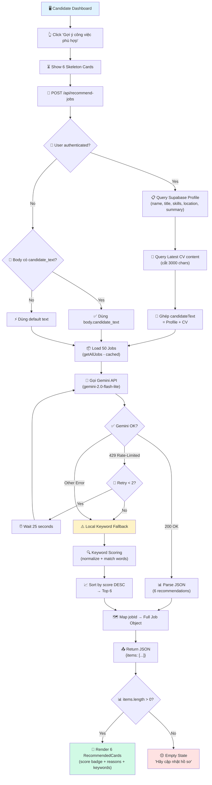
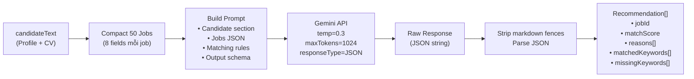
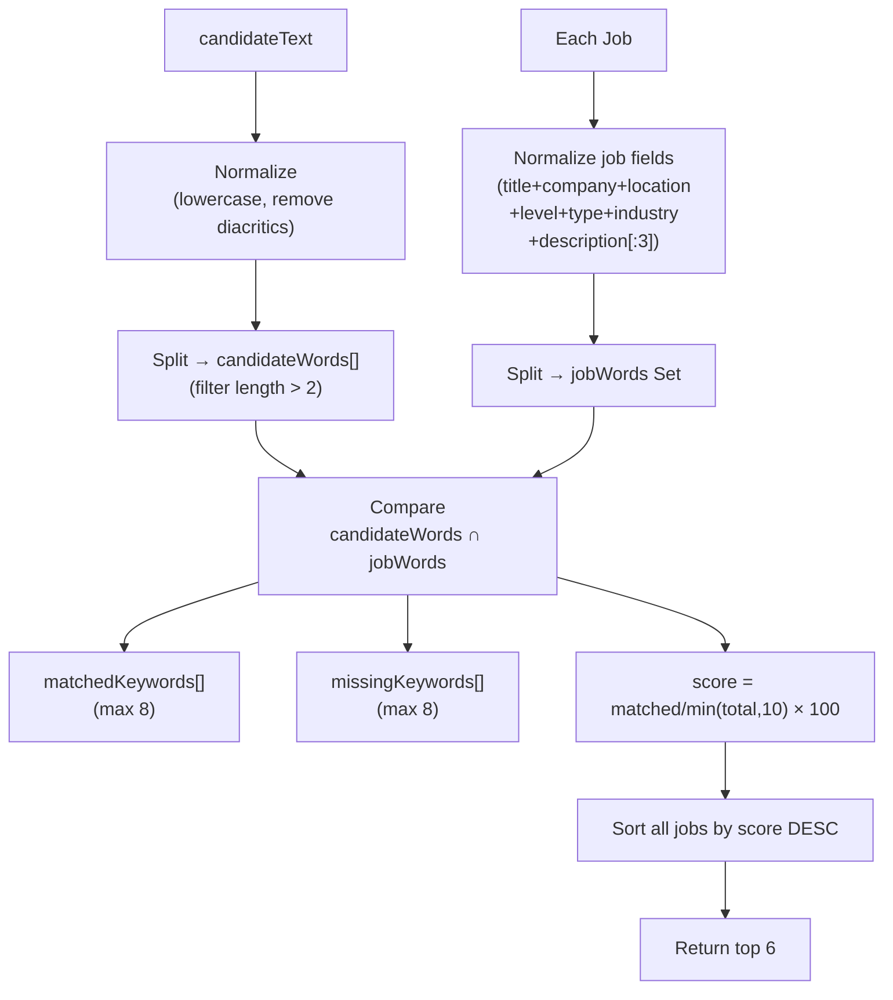
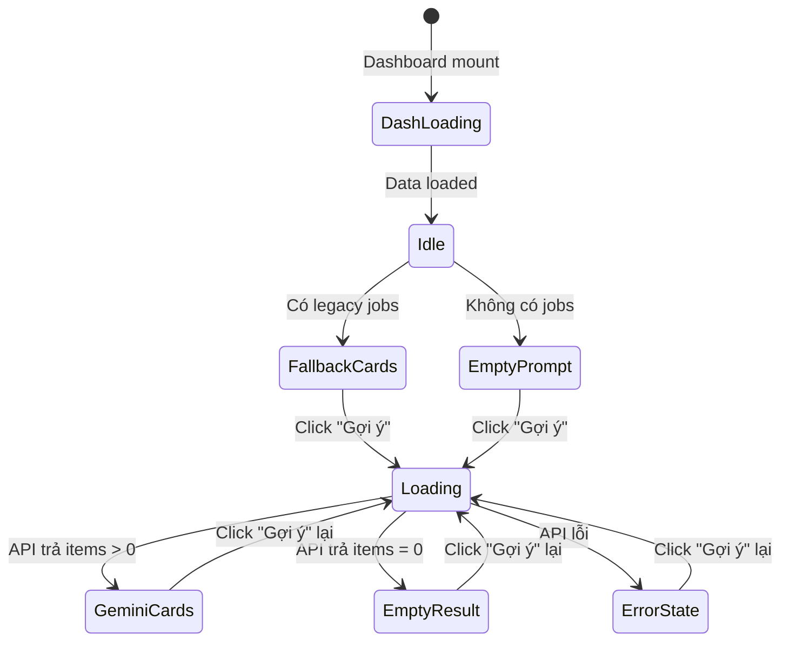
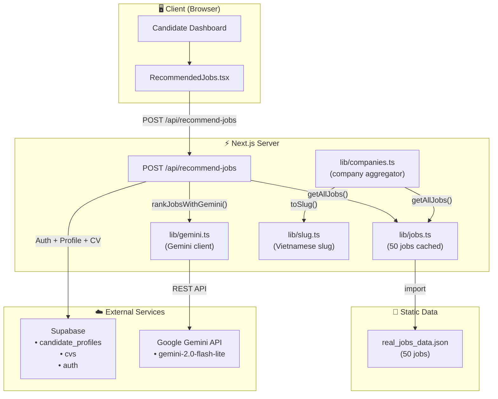
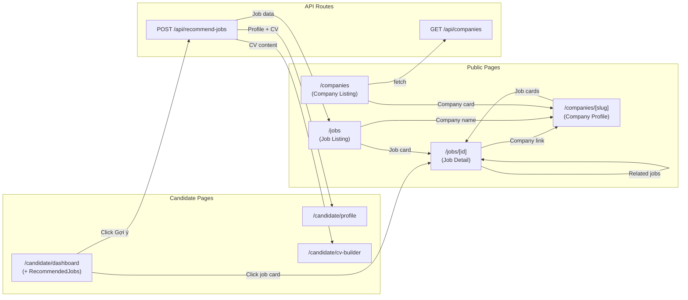

# AI Job Recommendation System – Flow & Architecture

> **TalentFlow Graduation Project**
> Ngày cập nhật: 03/03/2026

---

## 1️⃣ Overview

### Mục đích hệ thống

Hệ thống **AI Job Recommendation** sử dụng Google Gemini API để phân tích hồ sơ ứng viên (Profile + CV) và đối chiếu với danh sách việc làm thực tế, từ đó gợi ý top 6 công việc phù hợp nhất kèm theo điểm số, lý do cụ thể, và từ khóa khớp/thiếu.

### Vấn đề cần giải quyết

| Vấn đề | Giải pháp |
|---------|-----------|
| Ứng viên không biết chọn việc nào trong hàng chục tin tuyển dụng | AI xếp hạng và gợi ý top phù hợp |
| Không rõ mình thiếu kỹ năng gì so với yêu cầu | Hiển thị `matchedKeywords` và `missingKeywords` |
| Gemini API có giới hạn quota (429 rate-limit) | Tự động retry + fallback local keyword matching |
| Ứng viên chưa đăng nhập hoặc chưa có profile | Fallback text mặc định + chấp nhận body text |

---

## 2️⃣ Data Sources

### 2.1 Candidate Profile Data (Supabase)

Nguồn: Bảng `candidate_profiles` trên Supabase, truy vấn qua `user_id`.

```
candidate_profiles
├── full_name        (string)
├── desired_title    (string)     ← Vị trí mong muốn
├── skills           (string[])   ← Mảng kỹ năng
├── location         (string)     ← Địa điểm mong muốn
└── summary          (text)       ← Giới thiệu bản thân
```

**Cách trích xuất:**

```typescript
const parts: string[] = [];
if (profile.full_name)     parts.push(`Tên: ${profile.full_name}`);
if (profile.desired_title) parts.push(`Vị trí mong muốn: ${profile.desired_title}`);
if (profile.location)      parts.push(`Địa điểm: ${profile.location}`);
if (profile.skills)        parts.push(`Kỹ năng: ${profile.skills.join(", ")}`);
if (profile.summary)       parts.push(`Giới thiệu: ${profile.summary}`);
candidateText = parts.join("\n");
```

### 2.2 CV JSON Data (Supabase)

Nguồn: Bảng `cvs`, lấy bản mới nhất (`updated_at DESC`), trường `content` (JSON).

- Nội dung CV được convert thành string và cắt tối đa **3000 ký tự**
- Ghép nối vào `candidateText` dưới dạng: `\nCV:\n{cv_content}`

### 2.3 Jobs Data (Static JSON)

Nguồn: File `src/data/real_jobs_data.json` — **50 việc làm thực tế** từ CareerViet.

```typescript
interface Job {
  id: string;              // UUID
  title: string;           // "LỄ TÂN KHÁCH SẠN"
  company_name: string;    // "CÔNG TY TNHH KHÁCH SẠN 34"
  logo_url: string;
  cover_url: string;
  salary: string;          // "Lương: 7,5 Tr - 9 Tr VND"
  location: string;        // "Hồ Chí Minh"
  posted_date: string;
  source_url: string;
  description: string[];   // Mảng mô tả công việc
  requirements: string[];  // Mảng yêu cầu
  benefits: string[];      // Mảng quyền lợi
  industry: string[];      // ["Nhà hàng / Khách sạn"]
  experience_level: string | null;
  level: string;           // "Nhân viên"
  employment_type: string; // "Toàn thời gian"
  deadline: string;
  education_level: string;
  age_range: string;
  full_address: string;
}
```

Truy cập qua `lib/jobs.ts`:
- `getAllJobs()` → Tất cả 50 jobs (cached)
- `getJobById(id)` → Tìm theo UUID

### 2.4 Companies Data (Derived)

Nguồn: **Không có bảng riêng**. Dữ liệu công ty được tổng hợp (aggregate) từ jobs data.

```typescript
interface Company {
  slug: string;           // "cong-ty-tnhh-khach-san-34"
  name: string;           // "CÔNG TY TNHH KHÁCH SẠN 34"
  logoUrl: string | null;
  coverUrl: string | null;
  location: string | null;
  industry: string[];
  size: string | null;    // Luôn null (không có trong dataset)
  jobCount: number;       // Số jobs thuộc công ty
}
```

Slug được sinh từ `toSlug(company_name)` — chuẩn hóa tiếng Việt (bỏ dấu, lowercase, thay space bằng hyphen).

---

## 3️⃣ AI Recommendation Logic

### Tổng quan quy trình 7 bước

```
┌─────────────────────────────────────────────────────────────────┐
│  Step 1: Extract candidate_text từ Profile + CV                 │
│  Step 2: Load tất cả jobs (50 jobs)                             │
│  Step 3: Gọi Gemini API để ranking (hoặc fallback local)       │
│  Step 4: Gemini trả về jobId + matchScore + reasons             │
│  Step 5: Map jobId → full Job object                            │
│  Step 6: Trả về top 6 jobs cho client                           │
│  Step 7: Render cards trong "Việc làm phù hợp"                 │
└─────────────────────────────────────────────────────────────────┘
```

---

### Step 1: Extract `candidate_text`

API route thực hiện trích xuất theo thứ tự ưu tiên:

```
1. Auth User → Supabase Profile (full_name, desired_title, skills, location, summary)
       ↓ (nối thêm)
   + Latest CV content (cắt 3000 chars)
       ↓ (nếu rỗng)
2. Request body → body.candidate_text
       ↓ (nếu vẫn rỗng)
3. Fallback default → "Ứng viên đang tìm việc tại Việt Nam,
   quan tâm công nghệ, marketing và kinh doanh."
```

**Kết quả:** Một chuỗi `candidateText` dạng:

```
Tên: Nguyễn Văn A
Vị trí mong muốn: Frontend Developer
Địa điểm: Hồ Chí Minh
Kỹ năng: React, TypeScript, TailwindCSS, Node.js
Giới thiệu: 2 năm kinh nghiệm phát triển web...
CV:
{"sections":[{"type":"experience","data":{...}},...]}
```

---

### Step 2: Load all jobs

```typescript
const allJobs: Job[] = getAllJobs(); // 50 jobs từ real_jobs_data.json
```

Dữ liệu được cache ở module level — không đọc file mỗi lần gọi API.

---

### Step 3: Gọi Gemini API

#### 3a. Chuẩn bị prompt

Jobs được **nén (compact)** trước khi gửi lên Gemini để giảm token:

```typescript
const compactJobs = jobs.map((j) => ({
  id: j.id,
  title: j.title,
  company: j.company_name,
  location: j.location,
  salary: j.salary,
  industry: j.industry?.join(", "),
  level: j.level,
  snippet: j.description?.slice(0, 2).join(" ").slice(0, 200),
}));
```

Mỗi job chỉ giữ **8 trường thiết yếu**, description cắt còn 200 ký tự.

#### 3b. Prompt structure

```
[System instruction]
"You are a job matching and recommendation engine."

[Input 1: Candidate profile]
"""
{candidateText}
"""

[Input 2: Jobs array]
{JSON.stringify(compactJobs)}

[Task description]
"Rank the most suitable jobs and return TOP 6."

[Matching criteria (theo thứ tự ưu tiên)]
1. Title/role similarity
2. Skill overlap (QUAN TRỌNG NHẤT)
3. Experience fit (junior/mid/senior)
4. Location preference
5. Salary preference (chỉ khi rõ ràng)

[Output format]
JSON only, schema cố định
```

#### 3c. Gemini API call

```
Model:    gemini-2.0-flash-lite (mặc định, có thể override qua GEMINI_MODEL)
Endpoint: POST /v1beta/models/{model}:generateContent
API Key:  GEMINI_API_KEY (từ .env.local)

Generation Config:
├── temperature:       0.3    (deterministic, ít sáng tạo)
├── maxOutputTokens:   1024
└── responseMimeType:  "application/json"
```

#### 3d. Retry logic

```
Attempt 1 → Gọi Gemini
  ├── 200 OK → Parse JSON → Return
  ├── 429 Rate-Limited → Chờ 25s → Retry
  └── Other error → Retry

Attempt 2 → Gọi lại
  ├── 200 OK → Parse JSON → Return
  ├── 429 → Chờ 25s → Retry
  └── Other → Retry

Attempt 3 (final) → Gọi lại
  ├── 200 OK → Return
  └── Any error → throw Error → Trigger fallback
```

**MAX_RETRIES = 2** (tổng 3 lần gọi, mỗi lần retry chờ 25 giây).

---

### Step 3 (Fallback): Local Keyword Matching

Khi Gemini không khả dụng (quota hết, lỗi mạng...), hệ thống tự động chuyển sang **local keyword scoring**:

```
1. Normalize candidateText → tách thành mảng từ (> 2 ký tự)
2. Với mỗi job:
   a. Gộp title + company + location + level + type + industry + description → normalize
   b. Đếm số từ trùng khớp giữa candidate và job
   c. Tính matchScore = (matched / min(candidateWords, 10)) × 100
   d. Thu thập matchedKeywords (max 8) và missingKeywords (max 8)
3. Sort theo score giảm dần
4. Lấy top 6
5. Sinh reasons tự động:
   - Có match → "Phù hợp từ khóa: react, typescript, ..."
   - Không match → "Gợi ý dựa trên vị trí và ngành nghề phổ biến"
```

**So sánh Gemini vs Local Fallback:**

| Tiêu chí | Gemini AI | Local Fallback |
|----------|-----------|----------------|
| Độ chính xác | Cao (hiểu ngữ cảnh) | Trung bình (chỉ keyword) |
| Reasons | AI sinh bằng tiếng Việt | Template cố định |
| matchScore | AI đánh giá 0-100 | Tỷ lệ từ trùng × 100 |
| Tốc độ | 2-5s (+ retry nếu 429) | < 50ms |
| Chi phí | Tốn quota Gemini | Miễn phí |
| Available | Phụ thuộc API | Luôn sẵn sàng |

---

### Step 4: Gemini Response Schema

Gemini trả về JSON cố định:

```json
{
  "recommendations": [
    {
      "jobId": "b283252c-881a-4cf0-892b-9408ae4c691e",
      "matchScore": 85,
      "reasons": [
        "Vị trí phù hợp với kinh nghiệm 2 năm React",
        "Địa điểm Hồ Chí Minh trùng với mong muốn"
      ],
      "matchedKeywords": ["react", "typescript", "frontend", "hcm"],
      "missingKeywords": ["python", "aws"]
    }
  ]
}
```

**Giải thích từng trường:**

| Field | Type | Mô tả |
|-------|------|--------|
| `jobId` | `string` | UUID của job trong dataset |
| `matchScore` | `number (0-100)` | Điểm phù hợp tổng thể. ≥80 = xanh, ≥60 = vàng, <60 = xám |
| `reasons` | `string[]` | Lý do cụ thể bằng tiếng Việt (tối đa 2 hiển thị) |
| `matchedKeywords` | `string[]` | Từ khóa ứng viên khớp với job (tối đa 8, hiển thị 4) |
| `missingKeywords` | `string[]` | Từ khóa job yêu cầu mà ứng viên thiếu (tối đa 8, hiển thị 2) |

---

### Step 5: Map jobId → Full Job Object

```typescript
const jobMap = new Map(allJobs.map((j) => [j.id, j]));

const items = recommendations.map((rec) => {
  const job = jobMap.get(rec.jobId);
  if (!job) return null; // Bỏ qua nếu Gemini trả ID sai
  return {
    jobId: rec.jobId,
    matchScore: rec.matchScore,
    reasons: rec.reasons,
    matchedKeywords: rec.matchedKeywords,
    missingKeywords: rec.missingKeywords,
    job, // Full 22-field Job object
  };
}).filter(Boolean);
```

---

### Step 6: Trả về JSON cho client

```json
{
  "items": [
    {
      "jobId": "b283252c-...",
      "matchScore": 85,
      "reasons": ["..."],
      "matchedKeywords": ["react", "typescript"],
      "missingKeywords": ["python"],
      "job": {
        "id": "b283252c-...",
        "title": "Frontend Developer",
        "company_name": "...",
        "salary": "...",
        "location": "...",
        "..." : "... (tất cả 22 fields)"
      }
    }
  ]
}
```

---

### Step 7: Render trên Dashboard

Component `RecommendedJobs.tsx` hiển thị:

```
┌─────────────────────────────────────────────────────┐
│ [work icon] Việc làm phù hợp    [✨ Gợi ý công...] │ ← Header + Button
├─────────────────────────────────────────────────────┤
│  ┌─────────┐  ┌─────────┐  ┌─────────┐            │
│  │ Logo 85%│  │ Logo 72%│  │ Logo 60%│            │ ← Score badge (màu)
│  │ Title   │  │ Title   │  │ Title   │            │
│  │ Company │  │ Company │  │ Company │            │
│  │ Salary  │  │ Salary  │  │ Salary  │            │
│  │ ✨ Lý do│  │ ✨ Lý do│  │ ✨ Lý do│            │ ← AI reasons
│  │ [react] │  │ [node]  │  │ [sql]   │            │ ← Keyword pills
│  │ ~~aws~~ │  │ ~~k8s~~ │  │         │            │ ← Missing (gạch ngang)
│  └─────────┘  └─────────┘  └─────────┘            │
│  ┌─────────┐  ┌─────────┐  ┌─────────┐            │
│  │  Card 4 │  │  Card 5 │  │  Card 6 │            │ ← Grid 3 cột (xl)
│  └─────────┘  └─────────┘  └─────────┘            │
└─────────────────────────────────────────────────────┘
```

**UI States:**

| State | Hiển thị |
|-------|----------|
| Dashboard loading | 6 skeleton cards |
| Chưa click | Fallback cards (Supabase latest jobs) hoặc empty state |
| Đang gọi API | 6 skeleton cards + "Đang phân tích..." |
| Kết quả Gemini | 6 recommendation cards với score/reasons/keywords |
| Gemini trả 0 | Empty state "Hãy cập nhật hồ sơ" |
| API lỗi | Error banner đỏ |

---

## 4️⃣ API Flow

### Endpoint

```
POST /api/recommend-jobs
```

### Input

**Option A – Authenticated user (chính):**
Không cần body. API tự đọc profile + CV từ Supabase qua auth cookie.

**Option B – Testing/Anonymous:**
```json
{
  "candidate_text": "Frontend Developer, 2 năm React, TypeScript, Hồ Chí Minh"
}
```

### Processing Pipeline

```
Request
  │
  ├─ 1. Auth check (Supabase)
  │     ├─ Has user → Query profile + latest CV
  │     └─ No user → Try body.candidate_text → Fallback default
  │
  ├─ 2. Load 50 jobs (module cache)
  │
  ├─ 3. Call Gemini
  │     ├─ Success → Parse recommendations
  │     ├─ 429 → Retry (max 2 times, 25s delay each)
  │     └─ Error → Local keyword fallback
  │
  ├─ 4. Map jobId → full Job objects
  │
  └─ 5. Return JSON
```

### Output

**Success (200):**
```json
{
  "items": [
    {
      "jobId": "b283252c-881a-4cf0-892b-9408ae4c691e",
      "matchScore": 85,
      "reasons": [
        "Kỹ năng React và TypeScript phù hợp với yêu cầu Frontend",
        "Địa điểm Hồ Chí Minh đúng mong muốn ứng viên"
      ],
      "matchedKeywords": ["react", "typescript", "frontend", "hồ chí minh"],
      "missingKeywords": ["python", "aws"],
      "job": {
        "id": "b283252c-881a-4cf0-892b-9408ae4c691e",
        "title": "FRONTEND DEVELOPER (REACT)",
        "company_name": "CÔNG TY ABC TECH",
        "logo_url": "https://...",
        "cover_url": "https://...",
        "salary": "Lương: 15 Tr - 25 Tr VND",
        "location": "Hồ Chí Minh",
        "description": ["Phát triển giao diện...", "..."],
        "requirements": ["2+ năm React", "TypeScript", "..."],
        "benefits": ["Bảo hiểm", "Team building", "..."],
        "industry": ["IT - Phần mềm"],
        "level": "Nhân viên",
        "employment_type": "Toàn thời gian",
        "deadline": "31-03-2026",
        "education_level": "Đại học",
        "experience_level": "2 năm",
        "age_range": "22-35",
        "full_address": "Quận 1, TP.HCM",
        "posted_date": "01-03-2026",
        "source_url": "https://careerviet.vn/..."
      }
    }
  ]
}
```

**Error (500):**
```json
{
  "error": "Gemini API error 500: ...",
  "items": []
}
```

---

## 5️⃣ Activity Flow Diagrams

### 5.1 Main Flow – Toàn bộ quy trình gợi ý



### 5.2 Gemini Prompt Flow – Chi tiết xử lý AI



### 5.3 Local Fallback Flow – Keyword matching



### 5.4 Frontend State Machine – UI trạng thái



---

## 6️⃣ System Architecture Diagram



---

## 7️⃣ Connected Routes Overview



---

## 8️⃣ Technology Stack

| Layer | Technology | Version |
|-------|-----------|---------|
| Framework | Next.js (App Router) | 16.x (Turbopack) |
| Language | TypeScript | 5.x |
| Styling | TailwindCSS | 4.x |
| Auth & Database | Supabase | latest |
| AI Model | Google Gemini | gemini-2.0-flash-lite |
| Icons | Material Symbols Outlined | CDN |
| Deployment | Vercel (hoặc self-host) | — |

---

## 9️⃣ Key Design Decisions

| Quyết định | Lý do |
|------------|-------|
| Gemini flash-lite thay vì flash | Quota miễn phí cao hơn, đủ nhanh cho ranking |
| Temperature 0.3 | Kết quả ổn định, deterministic |
| Compact jobs (8 fields) | Giảm token → giảm chi phí + tránh token limit |
| MAX_RETRIES = 2, delay 25s | Gemini quota reset nhanh, 3 lần đủ để qua peak |
| Local fallback keyword matching | Đảm bảo UX luôn hoạt động kể cả khi AI down |
| candidateText max 3000 chars (CV) | Tránh vượt context window của Gemini |
| Top 6 results | Đủ để hiển thị grid 3×2 trên desktop |
| Reasons bằng tiếng Việt | Target user là người Việt |
| matchScore 0-100 integer | Dễ hiểu, dễ hiển thị dưới dạng phần trăm |
