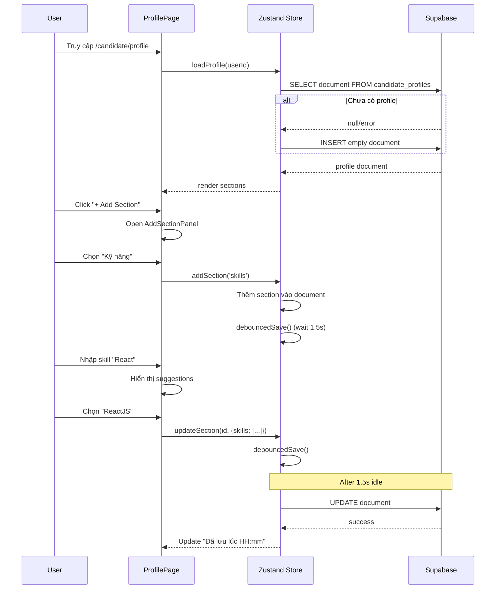

# Candidate Profile Builder - Thiết kế chi tiết

> **Phiên bản:** 1.0  
> **Ngày tạo:** 2026-02-04  
> **Stack:** Next.js 15 + React 19 + Tailwind CSS v4 + Supabase

---

## 1. Tổng quan

### 1.1 Mục tiêu

Xây dựng trang **Candidate Profile Builder** dạng modular, nơi người dùng:

- Bắt đầu với trang trống (blank profile)
- Tự thêm các **block/section** từ thư viện có sẵn
- Nhập liệu với gợi ý thông minh (autocomplete)
- Dữ liệu tự động lưu lên Supabase

### 1.2 Inspiration

- Notion block system
- Canva element library
- LinkedIn profile builder

---

## 2. Kiến trúc UI

```
┌─────────────────────────────────────────────────────────────────┐
│                        HEADER BAR                               │
│  [Avatar] Tên người dùng    [Save Status]    [+ Add Section]    │
├─────────────────────────────────────────────────────────────────┤
│                                                                 │
│  ┌─────────────────────────────────────────────────────────┐   │
│  │                PROFILE COMPLETION CARD                   │   │
│  │  ████████████░░░░░░  65% hoàn thiện                     │   │
│  │  [Gợi ý: Thêm Skills để tăng 15%]                       │   │
│  └─────────────────────────────────────────────────────────┘   │
│                                                                 │
│  ┌─────────────────────────────────────────────────────────┐   │
│  │  📋 SECTION: Thông tin cá nhân              [≡] [✏️] [🗑️] │
│  │  ─────────────────────────────────────────────────────── │   │
│  │  [Nội dung form hoặc empty state]                       │   │
│  └─────────────────────────────────────────────────────────┘   │
│                                                                 │
│  ┌─────────────────────────────────────────────────────────┐   │
│  │  💼 SECTION: Kinh nghiệm làm việc           [≡] [✏️] [🗑️] │
│  │  ─────────────────────────────────────────────────────── │   │
│  │  [Empty State: "Thêm kinh nghiệm đầu tiên"]             │   │
│  └─────────────────────────────────────────────────────────┘   │
│                                                                 │
│         ┌──────────────────────────────────────┐               │
│         │  + Thêm section mới                  │               │
│         └──────────────────────────────────────┘               │
│                                                                 │
└─────────────────────────────────────────────────────────────────┘
```

### 2.1 Header Bar

| Element            | Mô tả                                              |
| ------------------ | -------------------------------------------------- |
| Avatar + Tên       | Hiển thị user avatar và tên từ profile             |
| Save Status        | `Đang lưu...` / `Đã lưu lúc HH:mm` / `Lỗi kết nối` |
| Add Section Button | Mở panel chọn section                              |

### 2.2 Section Card

Mỗi section có cấu trúc:

```tsx
<SectionCard>
  <SectionHeader>
    <DragHandle />     // ≡ icon để kéo thả
    <Icon + Title />   // 📋 Thông tin cá nhân
    <Actions>          // Edit, Delete buttons
  </SectionHeader>
  <SectionContent>
    {isEmpty ? <EmptyState /> : <FilledContent />}
  </SectionContent>
</SectionCard>
```

### 2.3 Empty State

```tsx
<div className="text-center py-12">
  <Icon className="text-slate-300 text-5xl" />
  <h3>Chưa có thông tin</h3>
  <p className="text-slate-400">Thêm {sectionName} để hoàn thiện hồ sơ</p>
  <Button>+ Thêm thông tin</Button>
</div>
```

### 2.4 Add Section Panel (Modal/Sidebar)

```
┌─────────────────────────────────────────┐
│  Thêm section mới                   [X] │
│  ─────────────────────────────────────── │
│  🔍 Tìm kiếm...                         │
│                                          │
│  ▸ Thông tin cơ bản                     │
│    ├─ 👤 Thông tin cá nhân              │
│    ├─ 📝 Giới thiệu bản thân            │
│    └─ 🎯 Mục tiêu nghề nghiệp           │
│                                          │
│  ▸ Kỹ năng & Ngôn ngữ                   │
│    ├─ 🛠️ Kỹ năng                        │
│    └─ 🌐 Ngoại ngữ                       │
│                                          │
│  ▸ Kinh nghiệm                          │
│    ├─ 💼 Kinh nghiệm làm việc           │
│    ├─ 🎓 Học vấn                        │
│    ├─ 📜 Chứng chỉ                      │
│    └─ 🚀 Dự án                          │
│                                          │
│  ▸ Khác                                 │
│    └─ 🔗 Liên kết                       │
└─────────────────────────────────────────┘
```

---

## 3. Danh sách Block/Section

### 3.1 Block Definitions

| ID               | Tên               | Icon        | Fields                                       | Suggestion            |
| ---------------- | ----------------- | ----------- | -------------------------------------------- | --------------------- |
| `personal_info`  | Thông tin cá nhân | `person`    | fullName, email, phone, address, dob, gender | address               |
| `summary`        | Giới thiệu        | `article`   | content (textarea)                           | AI optional           |
| `skills`         | Kỹ năng           | `terminal`  | skills[] (tags)                              | ✅ skills dataset     |
| `languages`      | Ngoại ngữ         | `translate` | languages[] (name + level)                   | ✅ languages + levels |
| `experience`     | Kinh nghiệm       | `work`      | items[] (title, company, time, desc)         | job titles            |
| `education`      | Học vấn           | `school`    | items[] (school, major, year, gpa)           | ✅ schools dataset    |
| `certifications` | Chứng chỉ         | `badge`     | items[] (name, issuer, date, url)            | -                     |
| `projects`       | Dự án             | `rocket`    | items[] (name, desc, tech, url)              | -                     |
| `links`          | Liên kết          | `link`      | items[] (type, url)                          | predefined types      |
| `career_goal`    | Mục tiêu          | `flag`      | content (textarea)                           | -                     |

### 3.2 Chi tiết Fields từng Block

#### Personal Info

```typescript
interface PersonalInfoContent {
  fullName: string;
  email: string;
  phone: string;
  address: string; // có suggestion VN provinces
  dateOfBirth: string; // YYYY-MM-DD
  gender: "male" | "female" | "other";
  avatarUrl?: string;
}
```

#### Skills

```typescript
interface SkillsContent {
  skills: Array<{
    id: string;
    name: string;
    category?: string; // Frontend, Backend, Soft Skills...
  }>;
}
```

#### Languages

```typescript
interface LanguagesContent {
  languages: Array<{
    id: string;
    name: string; // Tiếng Anh, Tiếng Nhật...
    level: "beginner" | "intermediate" | "advanced" | "native";
    certification?: string; // IELTS 7.5, JLPT N2...
  }>;
}
```

#### Experience

```typescript
interface ExperienceContent {
  items: Array<{
    id: string;
    title: string; // có suggestion job titles
    company: string;
    location?: string;
    startDate: string;
    endDate?: string; // null = hiện tại
    isCurrent: boolean;
    description: string[]; // bullet points
  }>;
}
```

#### Education

```typescript
interface EducationContent {
  items: Array<{
    id: string;
    school: string; // có suggestion VN universities
    major: string; // có suggestion majors
    degree: string; // Cử nhân, Thạc sĩ...
    startYear: number;
    endYear?: number;
    gpa?: string;
  }>;
}
```

---

## 4. JSON Schema - Profile Document

```json
{
  "id": "uuid",
  "userId": "uuid",
  "meta": {
    "version": 1,
    "createdAt": "2026-02-04T12:00:00Z",
    "updatedAt": "2026-02-04T14:30:00Z"
  },
  "sections": [
    {
      "id": "section-uuid-1",
      "type": "personal_info",
      "order": 0,
      "isHidden": false,
      "content": {
        "fullName": "Nguyễn Văn A",
        "email": "nguyenvana@email.com",
        "phone": "0901234567",
        "address": "Quận 7, TP. Hồ Chí Minh",
        "dateOfBirth": "1995-01-01",
        "gender": "male"
      }
    },
    {
      "id": "section-uuid-2",
      "type": "skills",
      "order": 1,
      "isHidden": false,
      "content": {
        "skills": [
          { "id": "s1", "name": "ReactJS", "category": "Frontend" },
          { "id": "s2", "name": "TypeScript", "category": "Frontend" }
        ]
      }
    },
    {
      "id": "section-uuid-3",
      "type": "experience",
      "order": 2,
      "isHidden": false,
      "content": {
        "items": []
      }
    }
  ]
}
```

---

## 5. Smart Suggestion Strategy

### 5.1 MVP Approach: Local JSON Datasets

```
/src/data/suggestions/
├── skills.json           # ~500 skills phổ biến
├── languages.json        # ~50 ngôn ngữ + levels
├── vn-provinces.json     # 63 tỉnh/thành VN
├── vn-universities.json  # ~200 trường ĐH VN
├── majors.json           # ~100 ngành học phổ biến
└── job-titles.json       # ~300 vị trí công việc
```

### 5.2 Dataset Samples

#### skills.json

```json
{
  "frontend": [
    "ReactJS",
    "Vue.js",
    "Angular",
    "Next.js",
    "TypeScript",
    "JavaScript",
    "HTML/CSS",
    "Tailwind CSS",
    "SASS/SCSS"
  ],
  "backend": [
    "Node.js",
    "Python",
    "Java",
    "C#",
    ".NET",
    "Go",
    "PHP",
    "Ruby on Rails"
  ],
  "database": ["PostgreSQL", "MySQL", "MongoDB", "Redis", "Firebase"],
  "devops": ["Docker", "Kubernetes", "AWS", "GCP", "CI/CD", "Linux"],
  "soft_skills": [
    "Làm việc nhóm",
    "Giao tiếp",
    "Quản lý thời gian",
    "Tư duy phản biện"
  ]
}
```

#### languages.json

```json
[
  {
    "name": "Tiếng Anh",
    "code": "en",
    "certifications": ["IELTS", "TOEIC", "TOEFL"]
  },
  {
    "name": "Tiếng Nhật",
    "code": "ja",
    "certifications": ["JLPT N1", "JLPT N2", "JLPT N3", "JLPT N4", "JLPT N5"]
  },
  {
    "name": "Tiếng Hàn",
    "code": "ko",
    "certifications": ["TOPIK I", "TOPIK II"]
  },
  { "name": "Tiếng Trung", "code": "zh", "certifications": ["HSK 1-6"] }
]
```

#### vn-provinces.json

```json
[
  {
    "name": "TP. Hồ Chí Minh",
    "code": "HCM",
    "districts": ["Quận 1", "Quận 7", "Bình Thạnh", "..."]
  },
  {
    "name": "Hà Nội",
    "code": "HN",
    "districts": ["Hoàn Kiếm", "Đống Đa", "Cầu Giấy", "..."]
  }
]
```

### 5.3 Suggestion Component Pattern

```tsx
// components/SuggestionInput.tsx
interface SuggestionInputProps {
  value: string;
  onChange: (value: string) => void;
  suggestions: string[];
  placeholder?: string;
}

function SuggestionInput({
  value,
  onChange,
  suggestions,
  placeholder,
}: SuggestionInputProps) {
  const [filtered, setFiltered] = useState<string[]>([]);
  const [showDropdown, setShowDropdown] = useState(false);

  const handleInputChange = (input: string) => {
    onChange(input);
    // Fuzzy search
    const matches = suggestions
      .filter((s) => s.toLowerCase().includes(input.toLowerCase()))
      .slice(0, 8);
    setFiltered(matches);
    setShowDropdown(matches.length > 0);
  };

  return (
    <div className="relative">
      <input
        value={value}
        onChange={(e) => handleInputChange(e.target.value)}
        placeholder={placeholder}
        className="..."
      />
      {showDropdown && (
        <div className="absolute top-full left-0 right-0 bg-white shadow-xl rounded-xl mt-1 z-50">
          {filtered.map((item) => (
            <button
              key={item}
              onClick={() => {
                onChange(item);
                setShowDropdown(false);
              }}
              className="w-full px-4 py-3 text-left hover:bg-primary/5"
            >
              {item}
            </button>
          ))}
        </div>
      )}
    </div>
  );
}
```

---

## 6. Supabase Schema & RLS

### 6.1 SQL Schema

```sql
-- Bảng chứa profile document (JSONB)
CREATE TABLE candidate_profiles (
  id UUID PRIMARY KEY DEFAULT gen_random_uuid(),
  user_id UUID REFERENCES auth.users(id) ON DELETE CASCADE NOT NULL,
  document JSONB NOT NULL DEFAULT '{"meta":{"version":1},"sections":[]}',
  created_at TIMESTAMPTZ DEFAULT now(),
  updated_at TIMESTAMPTZ DEFAULT now(),

  CONSTRAINT unique_user_profile UNIQUE (user_id)
);

-- Index cho tìm kiếm trong JSONB (optional)
CREATE INDEX idx_profile_user ON candidate_profiles(user_id);

-- Trigger cập nhật updated_at
CREATE OR REPLACE FUNCTION update_updated_at()
RETURNS TRIGGER AS $$
BEGIN
  NEW.updated_at = now();
  RETURN NEW;
END;
$$ LANGUAGE plpgsql;

CREATE TRIGGER trigger_update_timestamp
  BEFORE UPDATE ON candidate_profiles
  FOR EACH ROW
  EXECUTE FUNCTION update_updated_at();
```

### 6.2 RLS Policies

```sql
-- Enable RLS
ALTER TABLE candidate_profiles ENABLE ROW LEVEL SECURITY;

-- Policy: User chỉ đọc profile của chính mình
CREATE POLICY "Users can view own profile"
  ON candidate_profiles FOR SELECT
  USING (auth.uid() = user_id);

-- Policy: User chỉ insert profile của chính mình
CREATE POLICY "Users can insert own profile"
  ON candidate_profiles FOR INSERT
  WITH CHECK (auth.uid() = user_id);

-- Policy: User chỉ update profile của chính mình
CREATE POLICY "Users can update own profile"
  ON candidate_profiles FOR UPDATE
  USING (auth.uid() = user_id)
  WITH CHECK (auth.uid() = user_id);

-- Policy: User chỉ delete profile của chính mình
CREATE POLICY "Users can delete own profile"
  ON candidate_profiles FOR DELETE
  USING (auth.uid() = user_id);
```

---

## 7. State Management (Zustand)

### 7.1 Store Structure

```typescript
// stores/profileBuilderStore.ts
import { create } from "zustand";
import { ProfileDocument, Section } from "@/types/profile";

interface ProfileBuilderState {
  // Document state
  document: ProfileDocument | null;
  isLoading: boolean;
  isSaving: boolean;
  lastSaved: Date | null;
  error: string | null;

  // UI state
  isAddPanelOpen: boolean;
  editingSectionId: string | null;

  // Actions
  loadProfile: (userId: string) => Promise<void>;
  saveProfile: () => Promise<void>;

  addSection: (type: SectionType) => void;
  updateSection: (sectionId: string, content: any) => void;
  removeSection: (sectionId: string) => void;
  reorderSections: (oldIndex: number, newIndex: number) => void;

  setAddPanelOpen: (open: boolean) => void;
  setEditingSection: (sectionId: string | null) => void;
}

export const useProfileBuilder = create<ProfileBuilderState>((set, get) => ({
  document: null,
  isLoading: true,
  isSaving: false,
  lastSaved: null,
  error: null,
  isAddPanelOpen: false,
  editingSectionId: null,

  loadProfile: async (userId) => {
    set({ isLoading: true, error: null });
    try {
      const supabase = createClient();
      const { data, error } = await supabase
        .from("candidate_profiles")
        .select("document")
        .eq("user_id", userId)
        .single();

      if (error && error.code === "PGRST116") {
        // No profile exists, create empty one
        const emptyDoc = { meta: { version: 1 }, sections: [] };
        await supabase
          .from("candidate_profiles")
          .insert({ user_id: userId, document: emptyDoc });
        set({ document: emptyDoc, isLoading: false });
      } else if (error) {
        throw error;
      } else {
        set({ document: data.document, isLoading: false });
      }
    } catch (err) {
      set({ error: "Không thể tải hồ sơ", isLoading: false });
    }
  },

  saveProfile: async () => {
    const { document } = get();
    if (!document) return;

    set({ isSaving: true });
    try {
      const supabase = createClient();
      const {
        data: { user },
      } = await supabase.auth.getUser();
      if (!user) throw new Error("Not authenticated");

      await supabase
        .from("candidate_profiles")
        .update({ document })
        .eq("user_id", user.id);

      set({ isSaving: false, lastSaved: new Date() });
    } catch (err) {
      set({ isSaving: false, error: "Lưu thất bại" });
    }
  },

  addSection: (type) => {
    set((state) => {
      if (!state.document) return state;

      const newSection: Section = {
        id: crypto.randomUUID(),
        type,
        order: state.document.sections.length,
        isHidden: false,
        content: getDefaultContent(type),
      };

      return {
        document: {
          ...state.document,
          sections: [...state.document.sections, newSection],
        },
      };
    });

    // Trigger autosave
    get().debouncedSave();
  },

  updateSection: (sectionId, content) => {
    set((state) => {
      if (!state.document) return state;

      return {
        document: {
          ...state.document,
          sections: state.document.sections.map((s) =>
            s.id === sectionId ? { ...s, content } : s,
          ),
        },
      };
    });

    // Trigger autosave
    get().debouncedSave();
  },

  removeSection: (sectionId) => {
    set((state) => {
      if (!state.document) return state;

      return {
        document: {
          ...state.document,
          sections: state.document.sections
            .filter((s) => s.id !== sectionId)
            .map((s, i) => ({ ...s, order: i })),
        },
      };
    });

    get().debouncedSave();
  },

  reorderSections: (oldIndex, newIndex) => {
    set((state) => {
      if (!state.document) return state;

      const sections = [...state.document.sections];
      const [moved] = sections.splice(oldIndex, 1);
      sections.splice(newIndex, 0, moved);

      return {
        document: {
          ...state.document,
          sections: sections.map((s, i) => ({ ...s, order: i })),
        },
      };
    });

    get().debouncedSave();
  },
}));
```

### 7.2 Autosave với Debounce

```typescript
// utils/debounce.ts
import { debounce } from "lodash";

// Trong store, thêm debouncedSave
const debouncedSave = debounce(() => {
  get().saveProfile();
}, 1500); // 1.5 giây sau thay đổi cuối
```

---

## 8. Component Structure

```
src/app/candidate/profile/
├── page.tsx                    # Main page wrapper
├── components/
│   ├── ProfileHeader.tsx       # Top bar với save status
│   ├── CompletionCard.tsx      # Thanh % hoàn thiện
│   ├── SectionCard.tsx         # Wrapper cho mỗi section
│   ├── AddSectionPanel.tsx     # Modal/Sidebar thêm section
│   ├── EmptyState.tsx          # UI khi section trống
│   │
│   ├── sections/               # Các section cụ thể
│   │   ├── PersonalInfoSection.tsx
│   │   ├── SummarySection.tsx
│   │   ├── SkillsSection.tsx
│   │   ├── LanguagesSection.tsx
│   │   ├── ExperienceSection.tsx
│   │   ├── EducationSection.tsx
│   │   ├── CertificationsSection.tsx
│   │   ├── ProjectsSection.tsx
│   │   ├── LinksSection.tsx
│   │   └── CareerGoalSection.tsx
│   │
│   └── inputs/                 # Input components với suggestion
│       ├── SuggestionInput.tsx
│       ├── SkillTagInput.tsx
│       ├── LanguageSelect.tsx
│       └── AddressInput.tsx
│
├── stores/
│   └── profileBuilderStore.ts  # Zustand store
│
└── types/
    └── profile.ts              # TypeScript types
```

---

## 9. Luồng hoạt động



---

## 10. Edge Cases & Checklist

### 10.1 Edge Cases

| Case                       | Xử lý                                             |
| -------------------------- | ------------------------------------------------- |
| **Trùng skill**            | Check exists trước khi add, show toast nếu trùng  |
| **Autosave conflict**      | Debounce 1.5s, queue save requests, optimistic UI |
| **Network mất**            | Show "Đang chờ kết nối", retry queue khi online   |
| **Reload giữa chừng**      | beforeunload warning nếu có unsaved changes       |
| **Section trống khi save** | Cho phép save section trống, UI hiện empty state  |
| **Reorder trong lúc edit** | Cancel edit mode trước khi drag                   |
| **User chưa auth**         | Redirect to login                                 |

### 10.2 Implementation Checklist

- [ ] **Database**
  - [ ] Tạo bảng `candidate_profiles`
  - [ ] Setup RLS policies
  - [ ] Test với multiple users

- [ ] **Data & Datasets**
  - [ ] Tạo skills.json (~500 skills)
  - [ ] Tạo languages.json
  - [ ] Tạo vn-provinces.json
  - [ ] Tạo vn-universities.json
  - [ ] Tạo majors.json

- [ ] **Components**
  - [ ] ProfileHeader với save status
  - [ ] CompletionCard với % calculation
  - [ ] SectionCard với drag handle
  - [ ] AddSectionPanel với search
  - [ ] EmptyState component
  - [ ] SuggestionInput component
  - [ ] SkillTagInput component

- [ ] **Sections**
  - [ ] PersonalInfoSection
  - [ ] SkillsSection
  - [ ] LanguagesSection
  - [ ] ExperienceSection
  - [ ] EducationSection
  - [ ] Các section còn lại

- [ ] **State Management**
  - [ ] Zustand store setup
  - [ ] Autosave với debounce
  - [ ] Optimistic updates
  - [ ] Error handling

- [ ] **UX**
  - [ ] Drag-and-drop reorder
  - [ ] Keyboard navigation cho suggestions
  - [ ] Loading skeletons
  - [ ] Toast notifications
  - [ ] Mobile responsive

---

## 11. Công nghệ đề xuất

| Feature          | Library                               |
| ---------------- | ------------------------------------- |
| State management | `zustand`                             |
| Drag & drop      | `@dnd-kit/core` + `@dnd-kit/sortable` |
| Form validation  | `zod` + React Hook Form (optional)    |
| Debounce         | `lodash/debounce` hoặc `use-debounce` |
| Toast            | `sonner` hoặc `react-hot-toast`       |
| UUID             | `crypto.randomUUID()` (native)        |

---

## 12. Tham khảo

- [Supabase Row Level Security](https://supabase.com/docs/guides/auth/row-level-security)
- [Zustand Documentation](https://zustand-demo.pmnd.rs/)
- [dnd-kit Sortable](https://docs.dndkit.com/presets/sortable)
- [Notion Block System](https://www.notion.so/)
